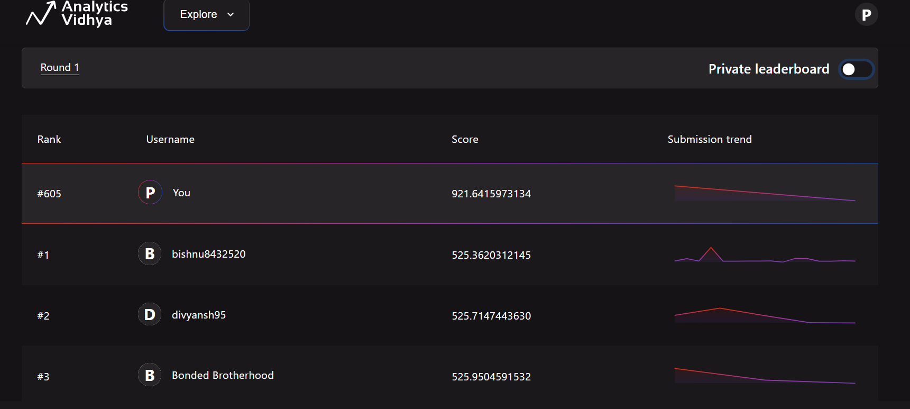

# redbus-demand-forecasting
Ranked Top 400 | Analytics Vidhya redBus Demand Forecasting Hackathon 2025 with Feature Engineering &amp; ML:  The project focuses on predicting bus seat demand 15 days before the journey date using historical booking and search data.

# 🚍 redBus Demand Forecasting – Analytics Vidhya Hackathon 2025

This repository contains my solution for the **[redBus Data Decode Hackathon 2025](https://www.analyticsvidhya.com/datahack/contest/redbus-data-decode-hackathon-2025/)** hosted by Analytics Vidhya.  
The goal of the competition was to **forecast the total number of seats booked for each route 15 days before the journey date** using booking and search data.

---

## 🏆 Competition Highlights
- 📊 **Task**: Demand forecasting for bus journeys.  
- 🛠️ **Approach**: Feature engineering + RandomForestRegressor model.  
- 📈 **Final Scores**:  
  - **Public LB Score**: `605`  
  - **Private LB Score**: `608`  
- 🎯 **Leaderboard Rank**: Achieved **Top 400** out of all participants.

---

## 📂 Repository Structure
├── redbus_randomFR_hackthon.ipynb # Jupyter Notebook with full pipeline
├── submission_file.csv # Final submission file
├── requirements.txt # Dependencies
├── README.md # Project description
└── leaderboardScore.png # Leaderboard screenshot 

---

## 🔑 Approach of Key Features of the Solution
1. **Data Preprocessing**  
   - Converted dates (`doj`, `doi`) into datetime format.  
   - Filtered transactions for **dbd = 15** (days before departure).  

2. **Feature Engineering**  
   - `doj_dayofweek` and `doj_month`  
   - `seat_to_search` = ratio of cumulative seats booked to searches.  

3. **Modeling**  
   - Used `RandomForestRegressor` with tuned hyperparameters.  
   - Evaluated with **RMSE** metric.  
   - Achieved **Train RMSE ≈ 538** and **Validation RMSE ≈ 638**.  

4. **Submission**  
   - Generated `submission_file.csv` with predicted seat counts.  

---

## 📷 Leaderboard Result



---

## ⚙️ Installation
Clone this repo and install dependencies:
```bash
git clone https://github.com/your-username/redbus-demand-forecasting.git
cd redbus-demand-forecasting
pip install -r requirements.txt

--
## 🚀 Usage
Open the notebook in Jupyter:
```bash
jupyter notebook redbus_randomFR_hackthon.ipynb

--
## 📌 Requirements
See requirements.txt for dependencies.

